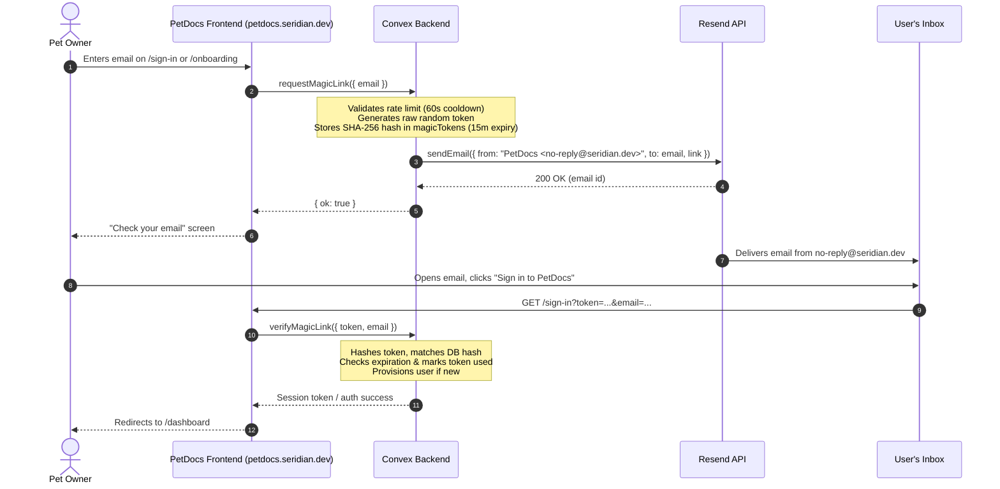

# 10 — Resend Setup (magic links + reminders)

## Active Production Configuration

| Setting | Value | Notes |
|---|---|---|
| **Production Site URL** | `https://petdocs.seridian.dev` | `SITE_URL` env on production Convex |
| **Verified Sending Domain** | `seridian.dev` | Verified via DNS (DKIM, SPF, DMARC) in Resend |
| **Sender Name & Address** | `PetDocs <no-reply@seridian.dev>` | Configured via `RESEND_FROM` |
| **Email Types Handled** | User registration, magic links, setup, reminders | Triggered by `convex/resend.ts` |

Registration and setup emails originate exclusively from **`PetDocs <no-reply@seridian.dev>`**. Because `seridian.dev` is fully verified, emails deliver to any external recipient without test-mode restrictions.

---

## For Angela (Product Owner Overview)

Resend powers all transactional email for PetDocs:

1. **Passwordless Sign-In (Magic Links):** When pet parents register or sign in, they enter their email and receive a 1-click login link within seconds. No passwords to remember or compromise.
2. **Booster & Health Reminders:** Scheduled reminder emails automatically alert owners when vaccinations, flea/tick medications, or annual exams are due.
3. **Sender Reputation:** All emails show the sender as `PetDocs <no-reply@seridian.dev>`. Verified domain records ensure high inbox placement (preventing emails from landing in spam).

The superadmin dashboard (`/dashboard/admin/integrations`) displays an active status indicator showing whether Resend is configured and sending.

---

## Technical Details

All outbound emails route through the internal Convex action `sendEmail` in `convex/resend.ts`:

- **Magic Links:** `convex/magicLink.ts` -> `requestMagicLink` (subject: `Sign in to PetDocs`)
- **Vaccine/Med Reminders:** `convex/reminders.ts` -> `sendDue` (subject: `Reminder: {title} for {pet}`)

> [!IMPORTANT]
> Email sending is strictly server-side. Never import `convex/resend.ts` or `convex/magicLink.ts` from client-side code under `src/`.

---

## Live Signup Flow & Verification Steps



### Step-by-Step Flow Breakdown:

1. **User Request:** The user visits [`https://petdocs.seridian.dev/sign-in`](https://petdocs.seridian.dev/sign-in) and enters their email.
2. **Backend Token Generation:** `convex/magicLink.ts:requestMagicLink` generates a cryptographically secure random token. Only the **SHA-256 hash** of this token is persisted in the `magicTokens` table with a 15-minute expiration timestamp.
3. **Anti-Abuse Gating:** If a token was requested within the last 60 seconds (`RESEND_COOLDOWN_MS`), the backend suppresses redundant email dispatches while still returning `{ ok: true }` to prevent user enumeration.
4. **Dispatch via Resend:** Convex calls Resend's REST API using `RESEND_API_KEY` with sender `PetDocs <no-reply@seridian.dev>`. The email contains an authenticated URL:
   `https://petdocs.seridian.dev/sign-in?token=<RAW_TOKEN>&email=<USER_EMAIL>`
5. **Verification & Session Grant:** When the user clicks the magic link, `verifyMagicLink` recalculates the SHA-256 hash of `<RAW_TOKEN>`, ensures it is unused and unexpired, registers or looks up the `users` record, and returns a verified session.

---

## Deployment Environment Variables

Convex environment variables are decoupled from Netlify/frontend variables. Set these variables per deployment using the Convex CLI.

### Production Environment (`https://petdocs.seridian.dev`)

```bash
bunx convex env set RESEND_API_KEY "re_live_xxxxxxxxxxxxxxxxxxxxxxxx"
bunx convex env set RESEND_FROM "PetDocs <no-reply@seridian.dev>"
bunx convex env set SITE_URL "https://petdocs.seridian.dev"
```

### Development Environment (Localhost)

```bash
bunx convex env set RESEND_API_KEY "re_test_xxxxxxxxxxxxxxxxxxxxxxxx"
bunx convex env set RESEND_FROM "PetDocs <no-reply@seridian.dev>"
bunx convex env set SITE_URL "http://localhost:3000"
```

*Note: If `SITE_URL` is omitted, it defaults to `http://localhost:3000`.*

---

## Domain DNS Verification (`seridian.dev`)

In the Resend Dashboard under **Domains**:

1. **Domain:** `seridian.dev`
2. **Required DNS Records:**
   - **DKIM:** TXT record `resend._domainkey.seridian.dev`
   - **SPF:** TXT or MX record configuring `send.seridian.dev` / `include:resend.com`
   - **DMARC:** TXT record `_dmarc.seridian.dev` (`v=DMARC1; p=none; ...`)
3. **Status Check:** Verify that Resend displays **Verified** in green. Outbound emails will only reliably clear DMARC checks once verified.

---

## Verification & Testing Runbook

### 1. Test Live Magic Link Sign-In
1. Navigate to [`https://petdocs.seridian.dev/sign-in`](https://petdocs.seridian.dev/sign-in).
2. Enter any standard external email address (Gmail, Outlook, iCloud).
3. Confirm delivery within 10–30 seconds.
4. Verify headers in your email client:
   - **From:** `PetDocs <no-reply@seridian.dev>`
   - **Mailed-By:** `resend.com` / `seridian.dev`
   - **Signed-By:** `seridian.dev`
5. Click the sign-in button and confirm seamless transition into the PetDocs dashboard.

### 2. Verify Delivery in Resend Dashboard
- Open [Resend Dashboard → Emails](https://resend.com/emails).
- Inspect the recent delivery event for `Sign in to PetDocs`.
- Check status: `Delivered`, `Opened`, or `Clicked`.

### 3. Verify Scheduled Reminders
To test reminder dispatches without waiting for the hourly cron tick:
1. Create a pet reminder in the dashboard with a due date within the next 24 hours.
2. Run the internal action via the Convex Dashboard playground or CLI:
   ```bash
   bunx convex run reminders:sendDue
   ```
3. Confirm that the reminder email arrives from `PetDocs <no-reply@seridian.dev>` and that the reminder record flips from `scheduled` to `sent`.

---

## Failure Handling & Security Guarantees

- **Account Enumeration Protection:** `requestMagicLink` returns `{ ok: true }` regardless of whether the email is existing, new, or throttled.
- **Fail-Safe Dispatches:** `sendEmail` catches missing credentials or network errors cleanly and returns `{ ok: false, error }` rather than crashing user transactions.
- **Secrets Isolation:** API keys and webhook secrets are never logged or exposed to client bundles.
- **Single-Use Tokens:** Raw tokens are never written to the database. Tokens cannot be reused once claimed.
